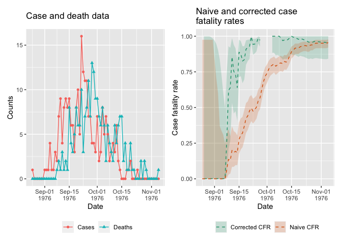
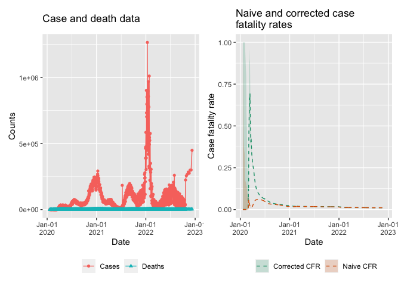

<!-- README.md is generated from README.Rmd. Please edit that file -->

# *datadelay*: Calculate robust epidemic case fatality rates

<!-- badges: start -->

[](https://opensource.org/licenses/MIT)
[](https://github.com/epiverse-trace/datadelay/actions/workflows/R-CMD-check.yaml)
[](https://app.codecov.io/gh/epiverse-trace/datadelay?branch=main)
[](https://CRAN.R-project.org/package=datadelay)
<!-- badges: end -->

The goal of datadelay is to provide robust estimates of the case
fatality rate of an epidemic.

## Installation

You can install the development version of datadelay from
[GitHub](https://github.com/) with:

``` r
# install.packages("devtools")
devtools::install_github("epiverse-trace/datadelay")
```

## Quick start

### Ebola 1976

This example of basic usage shows how to use *datadelay* to estimate
case fatality ratios from the 1976 Ebola outbreak.

``` r
# Load package
library(datadelay)

# Load the Ebola 1976 data provided with the package
data("ebola1976")

# Get the onset to death distribution for ebola virus disease
# from the {epiparameter} package
onset_to_death_ebola <- epiparameter::epidist(
  pathogen = "ebola",
  delay_dist = "onset_to_death"
)

# Access the probability mass function
delay_pmf <- onset_to_death_ebola$pmf

# Calculate the static naive and corrected CFRs
ncfr <- static_cfr(ebola1976, correct_for_delays = FALSE)
ccfr <- static_cfr(ebola1976, correct_for_delays = TRUE, delay_pmf)

# Print nicely formatted case fatality rate estimates
format_cfr_neatly(ncfr)
#> [1] "CFR: 0.955% (95% Ci: 0.921% -- 0.977%)"
format_cfr_neatly(ccfr)
#> [1] "CFR: 0.970% (95% Ci: 0.851% -- 1.000%)"
```

Calculate and plot the rolling CFR.

``` r
# Calculate rolling naive and corrected CFRs
df_ncfr <- rolling_cfr(ebola1976, correct_for_delays = FALSE)
df_ccfr <- rolling_cfr(
  ebola1976,
  correct_for_delays = TRUE,
  delay_pmf
)

# Plotting case and death data along with CFRs
plot_data_and_cfr(df_ncfr, df_ccfr)
```



### Covid-19

``` r
# Load packages for Covid case data
# install.packages("covidregionaldata") # some issue here
library(covidregionaldata)
```

Access and prepare case data.

``` r
# Example with US case data
# access the data
covid_data_us <- covidregionaldata::get_national_data(
  countries = "united states", source = "who"
)

# prepare the data
covid_data_us <- covid_data_us[, c("date", "cases_new", "deaths_new")]
colnames(covid_data_us) <- c("date", "cases", "deaths")

# remove rows where cases are 0, causes errors for uncorrected CFR
covid_data_us <- covid_data_us[covid_data_us$cases > 0, ]
```

Calculate rolling CFR.

``` r
# Extract probability mass function for onset-to-death
onset_death_covid <- epiparameter::epidist(
  pathogen = "SARS_CoV_2",
  delay_dist = "onset_to_death"
)
onset_death_covid_pmf <- onset_death_covid$pmf

covid_us_cfr_naive <- rolling_cfr(
  df_in = covid_data_us,
  correct_for_delays = FALSE
)

covid_us_cfr_corrected <- rolling_cfr(
  df_in = covid_data_us,
  correct_for_delays = TRUE,
  delay_pmf = onset_death_covid_pmf
)
```

``` r
plot_data_and_cfr(
  df_ncfr = covid_us_cfr_naive,
  df_ccfr = covid_us_cfr_corrected
)
```


