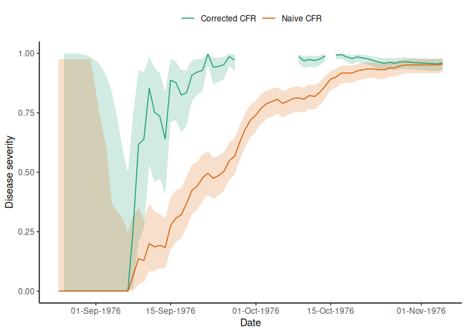

<!-- README.md is generated from README.Rmd. Please edit that file -->

# cfr: Estimate disease severity and under-reporting 

<!-- badges: start -->

<a href="https://app.digitalpublicgoods.net/a/11092">
[](https://opensource.org/license/mit/)
[](https://github.com/epiverse-trace/cfr/actions/workflows/R-CMD-check.yaml)
[](https://app.codecov.io/gh/epiverse-trace/cfr?branch=main)
[](https://lifecycle.r-lib.org/articles/stages.html#stable)
[](https://www.repostatus.org/#active)
[](https://CRAN.R-project.org/package=cfr)
<!-- badges: end -->

*cfr* is an R package to estimate disease severity and under-reporting
in real-time, accounting for delays in epidemic time-series.

*cfr* provides simple, fast methods to calculate the overall or static
case fatality risk (CFR) of an outbreak up to a given time point, as
well as how the CFR changes over the course of the outbreak. *cfr* can
help estimate disease under-reporting in real-time, accounting for
delays reporting the outcomes of cases.

*cfr* implements methods outlined in Nishiura et al.
([2009](#ref-nishiura2009)). There are plans to add estimates based on
other methods.

*cfr* is developed at the [Centre for the Mathematical Modelling of
Infectious
Diseases](https://www.lshtm.ac.uk/research/centres/centre-mathematical-modelling-infectious-diseases)
at the London School of Hygiene and Tropical Medicine as part of the
[Epiverse-TRACE initiative](https://data.org/initiatives/epiverse/).

## Installation

*cfr* can be installed from CRAN using

``` r
install.packages("cfr")
```

The current development version of *cfr* can be installed from
[GitHub](https://github.com/) using the `pak` package.

``` r
if(!require("pak")) install.packages("pak")
pak::pak("epiverse-trace/cfr")
```

## Quick start

### Overall severity of the 1976 Ebola outbreak

This example shows how to use *cfr* to estimate the overall case
fatality risks from the 1976 Ebola outbreak ([Camacho et al.
2014](#ref-camacho2014)), while correcting for delays using a
Gamma-distributed onset to death duration taken from Barry et al.
([2018](#ref-barry2018)), with a shape $k$ of 2.40 and a scale $\theta$
of 3.33.

``` r
# Load package
library(cfr)

# Load the Ebola 1976 data provided with the package
data("ebola1976")

# Calculate the static CFR without correcting for delays
cfr_static(data = ebola1976)
#>   severity_mean severity_low severity_high
#> 1      0.955102    0.9210866     0.9773771
```

``` r

# Calculate the static CFR while correcting for delays
cfr_static(
  data = ebola1976,
  delay_density = function(x) dgamma(x, shape = 2.40, scale = 3.33)
)
#>   severity_mean severity_low severity_high
#> 1        0.9742       0.8356        0.9877
```

### Change in real-time estimates of overall severity during the 1976 Ebola outbreak

In this example we show how the estimate of overall severity can change
as more data on cases and deaths over time becomes available, using the
function `cfr_rolling()`. Because there is a delay from onset-to-death,
a simple “naive” calculation that just divides deaths-to-date by
cases-to-date will underestimate severity. The `cfr_rolling()` function
uses the `estimate_severity()` adjustment internally to account for
delays, and instead compares deaths-to-date with
cases-with-known-outcome-to-date. The adjusted estimate converges to the
naive estimate as the outbreak declines and a larger proportion of cases
have known outcomes.

``` r
# Calculate the CFR without correcting for delays on each day of the outbreak
rolling_cfr_naive <- cfr_rolling(
  data = ebola1976
)

# see the first few rows
head(rolling_cfr_naive)
#>         date severity_mean severity_low severity_high
#> 1 1976-08-25             0            0         0.975
#> 2 1976-08-26             0            0         0.975
#> 3 1976-08-27             0            0         0.975
#> 4 1976-08-28             0            0         0.975
#> 5 1976-08-29             0            0         0.975
#> 6 1976-08-30             0            0         0.975
```

``` r

# Calculate the rolling daily CFR while correcting for delays
rolling_cfr_corrected <- cfr_rolling(
  data = ebola1976,
  delay_density = function(x) dgamma(x, shape = 2.40, scale = 3.33)
)

head(rolling_cfr_corrected)
#>         date severity_mean severity_low severity_high
#> 1 1976-08-25            NA           NA            NA
#> 2 1976-08-26         1e-04        1e-04        0.9999
#> 3 1976-08-27         1e-04        1e-04        0.9999
#> 4 1976-08-28         1e-04        1e-04        0.9999
#> 5 1976-08-29         1e-04        1e-04        0.9990
#> 6 1976-08-30         1e-04        1e-04        0.9942
```

We plot the rolling CFR to visualise how severity changes over time,
using the [*ggplot2* package](https://ggplot2.tidyverse.org/). The
plotting code is hidden here.

``` r
# combine the data for plotting
rolling_cfr_naive$method <- "naive"
rolling_cfr_corrected$method <- "corrected"

data_cfr <- rbind(
  rolling_cfr_naive,
  rolling_cfr_corrected
)
```

<div class="figure">


<p class="caption">
Disease severity of ebola in the 1976 outbreak estimated on each day of
the epidemic. The rolling CFR value converges to the static value
towards the end of the outbreak. Both corrected and uncorrected
estimates are shown.
</p>

</div>

## Package vignettes

More details on how to use *cfr* can be found in the [online
documentation as package
vignettes](https://epiverse-trace.github.io/cfr/), under “Articles”.

## Help

To report a bug please open an
[issue](https://github.com/epiverse-trace/cfr/issues/new/choose).

## Contribute

Contributions to *cfr* are welcomed. Please follow the [package
contributing
guide](https://github.com/epiverse-trace/cfr/blob/main/.github/CONTRIBUTING.md).

## Code of conduct

Please note that the *cfr* project is released with a [Contributor Code
of
Conduct](https://github.com/epiverse-trace/.github/blob/main/CODE_OF_CONDUCT.md).
By contributing to this project, you agree to abide by its terms.

## Related projects

*cfr* functionality overlaps with that of some other packages, including

- [*coarseDataTools*](https://cran.r-project.org/package=coarseDataTools)
  is an R package that allows estimation of relative case fatality risk
  between covariate groups while accounting for delays due to survival
  time, when numbers of deaths and recoveries over time are known. *cfr*
  uses simpler methods from Nishiura et al. ([2009](#ref-nishiura2009))
  that can be applied when only cases and deaths over time are known,
  generating estimates based on all data to date, as well as
  time-varying estimates. *cfr* can also convert estimates of cases with
  known outcomes over time into an estimate of under-ascertainment, if a
  baseline estimate of fatality risk is available from the literature
  (e.g. from past outbreaks).
- [*EpiNow2*](https://cran.r-project.org/package=EpiNow2) is an R
  package that can allow estimation of case fatality risk if it is
  defined as a secondary observation of cases. In particular, it allows
  for estimation that accounts for the smooth underlying epidemic
  process, but this requires additional computational effort. A
  comparison of these methods is planned for a future release.

*cfr* is in future expected to benefit from the functionality of the
forthcoming [*epiparameter*
package](https://epiverse-trace.github.io/epiparameter/), which is also
developed by Epiverse-TRACE. *epiparameter* aims to provide a library of
epidemiological parameters to parameterise delay density functions, as
well as the convenient `<epidist>` class to store, access, and pass
these parameters for delay correction.

## References

<div id="refs" class="references csl-bib-body hanging-indent"
entry-spacing="0">

<div id="ref-barry2018" class="csl-entry">

Barry, Ahmadou, Steve Ahuka-Mundeke, Yahaya Ali Ahmed, Yokouide
Allarangar, Julienne Anoko, Brett Nicholas Archer, Aaron Aruna Abedi, et
al. 2018. “Outbreak of Ebola virus disease in the Democratic Republic of
the Congo, April–May, 2018: an epidemiological study.” *The Lancet* 392
(10143): 213–21. <https://doi.org/10.1016/S0140-6736(18)31387-4>.

</div>

<div id="ref-camacho2014" class="csl-entry">

Camacho, A., A. J. Kucharski, S. Funk, J. Breman, P. Piot, and W. J.
Edmunds. 2014. “Potential for Large Outbreaks of Ebola Virus Disease.”
*Epidemics* 9 (December): 70–78.
<https://doi.org/10.1016/j.epidem.2014.09.003>.

</div>

<div id="ref-nishiura2009" class="csl-entry">

Nishiura, Hiroshi, Don Klinkenberg, Mick Roberts, and Johan A. P.
Heesterbeek. 2009. “Early Epidemiological Assessment of the Virulence of
Emerging Infectious Diseases: A Case Study of an Influenza Pandemic.”
*PLOS ONE* 4 (8): e6852. <https://doi.org/10.1371/journal.pone.0006852>.

</div>

</div>
