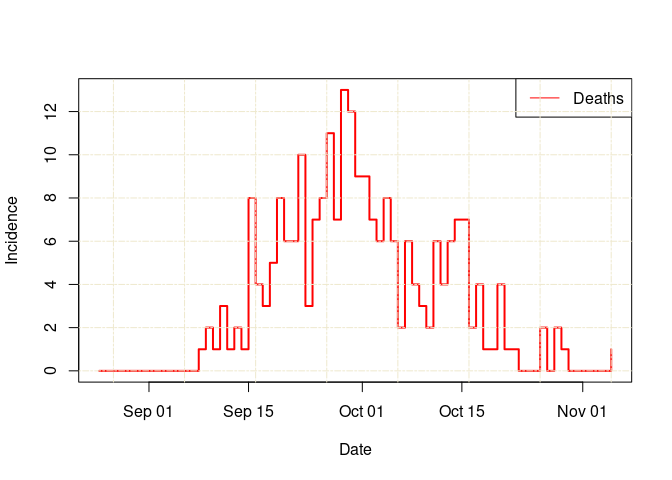
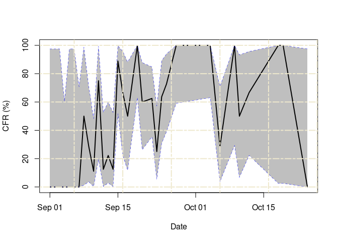

<!-- README.md is generated from README.Rmd. Please edit that file -->

# *datadelay*: Estimating disease severity and under-reporting

<!-- badges: start -->

[](https://opensource.org/licenses/MIT)
[](https://github.com/epiverse-trace/datadelay/actions/workflows/R-CMD-check.yaml)
[](https://app.codecov.io/gh/epiverse-trace/datadelay?branch=main)
[](https://lifecycle.r-lib.org/articles/stages.html#experimental)
[](https://www.repostatus.org/#wip)
[](https://CRAN.R-project.org/package=datadelay)
<!-- badges: end -->

*datadelay* is an R package that provides simple, fast methods, based in
part on Nishiura et al. ([2009](#ref-nishiura2009)), to estimate disease
severity and under-reporting in real-time, accounting for delays in
epidemic time-series.

## Installation

The current development version of *datadelay* can be installed from
[GitHub](https://github.com/) using the `pak` package.

``` r
if(!require("pak")) install.packages("pak")
pak::pak("epiverse-trace/datadelay")

# Also install R package {epiparameter} for epidemiological parameter values
pak::pak("epiverse-trace/epiparameter")
```

## Quick start

### Ebola 1976

This example of basic usage shows how to use *datadelay* to estimate
case fatality ratios from the 1976 Ebola outbreak.

``` r
# Load package
library(datadelay)

# Load the Ebola 1976 data provided with the package
data("ebola1976")

# assign a location
ebola1976$location <- "DRC"

# read epidist for EVD onset to death from {epiparameter}
# accesses parameters reported in https://doi.org/10.1016/S0140-6736(18)31387-4
onset_to_death_ebola <- epiparameter::epidist_db(
  disease = "Ebola Virus Disease",
  epi_dist = "onset_to_death",
  author = "Barry_etal"
)

# Calculate the static naive and corrected CFRs
ncfr <- estimate_static(
  df_in = ebola1976, correct_for_delays = FALSE, location = "location"
)
ccfr <- estimate_static(
  df_in = ebola1976,
  correct_for_delays = TRUE,
  epi_dist = onset_to_death_ebola,
  location = "location"
)

# Print nicely formatted case fatality rate estimates
format_output(ncfr, estimate_type = "severity")
#>   Location                         Estimate
#> 1      DRC 95.51% (95% CI: 92.11% - 97.74%)
format_output(ccfr, estimate_type = "severity")
#>   Location                          Estimate
#> 1      DRC 95.90% (95% CI: 84.20% - 100.00%)
```

Calculate and plot real-time CFR estimates up to a given point in time.

``` r
# Calculate naive and corrected static CFRs up to a given point in time
df_ncfr <- estimate_time_varying(
  df_in = ebola1976, correct_for_delays = FALSE,
  burn_in_value = 7
)

df_ccfr <- estimate_time_varying(
  ebola1976,
  correct_for_delays = TRUE,
  epi_dist = onset_to_death_ebola,
  burn_in_value = 7
)

# plot case and death data
plot_case_data(df_ccfr)
```


``` r
plot_death_data(df_ccfr)
```



``` r

# Plotting case and death data along with CFRs
plot_time_varying(df_ncfr, lower = 0, upper = 100)
```



## Package vignettes

More details on how to use *datadelay* can be found in the [online
documentation as package
vignettes](https://epiverse-trace.github.io/datadelay/), under
“Articles”.

## Help

To report a bug please open an
[issue](https://github.com/epiverse-trace/datadelay/issues/new/choose).

## Contribute

Contributions to *datadelay* are welcomed. Please follow the [package
contributing
guide](https://github.com/epiverse-trace/datadelay/blob/main/.github/CONTRIBUTING.md).

## Code of conduct

Please note that the *datadelay* project is released with a [Contributor
Code of
Conduct](https://github.com/epiverse-trace/.github/blob/main/CODE_OF_CONDUCT.md).
By contributing to this project, you agree to abide by its terms.

## References

<div id="refs" class="references csl-bib-body hanging-indent">

<div id="ref-nishiura2009" class="csl-entry">

Nishiura, Hiroshi, Don Klinkenberg, Mick Roberts, and Johan A. P.
Heesterbeek. 2009. “Early Epidemiological Assessment of the Virulence of
Emerging Infectious Diseases: A Case Study of an Influenza Pandemic.”
*PLOS ONE* 4 (8): e6852. <https://doi.org/10.1371/journal.pone.0006852>.

</div>

</div>
