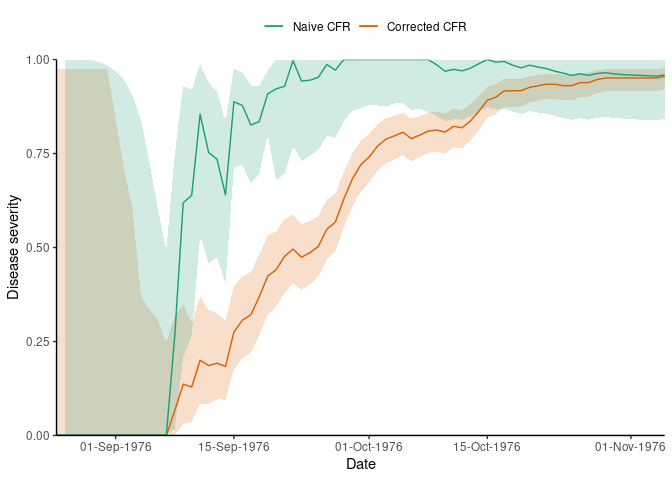

<!-- README.md is generated from README.Rmd. Please edit that file -->

# *cfr*: Estimate disease severity and under-reporting 

<!-- badges: start -->

[](https://opensource.org/license/mit)
[](https://github.com/epiverse-trace/cfr/actions/workflows/R-CMD-check.yaml)
[](https://app.codecov.io/gh/epiverse-trace/cfr?branch=main)
[](https://lifecycle.r-lib.org/articles/stages.html#experimental)
[](https://www.repostatus.org/#wip)
[](https://CRAN.R-project.org/package=cfr)
<!-- badges: end -->

*cfr* is an R package to estimate disease severity and under-reporting
in real-time, accounting for delays in epidemic time-series.

*cfr* provides simple, fast methods to calculate the overall or static
case fatality risk (CFR) of an outbreak up to a given time point, as
well as how the CFR changes over the course of the outbreak. *cfr* can
help estimate disease under-reporting in real-time, accounting for
delays reporting the outcomes of cases.

*cfr* implements methods outlined in Nishiura et al.
([2009](#ref-nishiura2009)). There are plans to add estimates based on
other methods.

*cfr* supports using the [*epiparameter*
package](https://epiverse-trace.github.io/epiparameter/) to pass
epidemiological delay distributions in order to calculate
delay-corrected CFR estimates, and both packages are developed at the
[Centre for the Mathematical Modelling of Infectious
Diseases](https://www.lshtm.ac.uk/research/centres/centre-mathematical-modelling-infectious-diseases)
at the London School of Hygiene and Tropical Medicine as part of the
[Epiverse-TRACE initiative](https://data.org/initiatives/epiverse/).

## Installation

The current development version of *cfr* can be installed from
[GitHub](https://github.com/) using the `pak` package.

``` r
if(!require("pak")) install.packages("pak")
pak::pak("epiverse-trace/cfr")

# Also install R package {epiparameter} for epidemiological parameter values
pak::pak("epiverse-trace/epiparameter")
```

## Quick start

### Overall severity of the 1976 Ebola outbreak

This example shows how to use *cfr* to estimate the overall case
fatality risks from the 1976 Ebola outbreak ([Camacho et al.
2014](#ref-camacho2014)), while correcting for delays using an ‘onset to
death’ distribution from the *epiparameter* package.

``` r
# Load package
library(cfr)

# Load the Ebola 1976 data provided with the package
data("ebola1976")

# read delay distribution for ebolavirus onset to death from {epiparameter}
# accesses parameters reported in https://doi.org/10.1016/S0140-6736(18)31387-4
onset_to_death_ebola <- epiparameter::epidist_db(
  disease = "Ebola Virus Disease",
  epi_dist = "onset_to_death",
  author = "The-Ebola-Outbreak-Epidemiology-Team",
  single_epidist = TRUE
)

# View distribution parameters
epiparameter::get_parameters(onset_to_death_ebola)
#>  shape  scale 
#> 2.4000 3.3333

# Calculate the static CFR without correcting for delays
cfr_static(data = ebola1976)
#>   severity_mean severity_low severity_high
#> 1      0.955102    0.9210866     0.9773771

# Calculate the static CFR while correcting for delays
cfr_static(
  data = ebola1976,
  delay_dist = onset_to_death_ebola
)
#>   severity_mean severity_low severity_high
#> 1         0.959        0.842             1
```

*cfr* also allows users to correct for any desired delay distribution by
allowing `delay_dist` to optionally be a function that wraps around the
probability density function (or probability mass function) for the
distribution.

Here, we replicate the example above but with slightly different shape
and scale parameters.

``` r
# Replicate the example above:
# define a probability density function for a Gamma distribution
# with shape = 3.0, and scale = 4.0 (from the {epiparameter} library)
dens_gamma <- function(x) {
  stats::dgamma(shape = 3.0, scale = 4.0, x = x)
}

# calculate the static CFR for ebola
cfr_static(
  data = ebola1976,
  delay_dist = dens_gamma
)
#>   severity_mean severity_low severity_high
#> 1         0.967        0.848             1
```

### Change in real-time estimates of overall severity during the 1976 Ebola outbreak

In this example we show how the estimate of overall severity can change
as more data on cases and deaths over time becomes available, using the
function `cfr_rolling()`. The adjusted estimate converges to the naive
estimate as the outbreak declines and a larger proportion of cases have
known outcomes.

``` r
# Calculate the CFR without correcting for delays on each day of the outbreak
rolling_cfr_naive <- cfr_rolling(
  data = ebola1976
)

# add the date from the outbreak
rolling_cfr_naive <- cbind(date = ebola1976[, "date"], rolling_cfr_naive)

# see the first few rows
head(rolling_cfr_naive)
#>         date severity_mean severity_low severity_high
#> 1 1976-08-25             0            0         0.975
#> 2 1976-08-26             0            0         0.975
#> 3 1976-08-27             0            0         0.975
#> 4 1976-08-28             0            0         0.975
#> 5 1976-08-29             0            0         0.975
#> 6 1976-08-30             0            0         0.975

# Calculate the rolling daily CFR while correcting for delays
rolling_cfr_corrected <- cfr_rolling(
  data = ebola1976,
  delay_dist = onset_to_death_ebola
)

# add the date from the outbreak
rolling_cfr_corrected <- cbind(
  date = ebola1976[, "date"],
  rolling_cfr_corrected
)

head(rolling_cfr_corrected)
#>         date severity_mean severity_low severity_high
#> 1 1976-08-25         0.001           NA            NA
#> 2 1976-08-26         0.001        0.001         0.999
#> 3 1976-08-27         0.001        0.001         0.999
#> 4 1976-08-28         0.001        0.001         0.999
#> 5 1976-08-29         0.001        0.001         0.999
#> 6 1976-08-30         0.001        0.001         0.994
```

We plot the rolling CFR to visualise how severity changes over time,
using the [*ggplot2* package](https://ggplot2.tidyverse.org/). The
plotting code is hidden here.

<div class="figure">


<p class="caption">
Disease severity of ebola in the 1976 outbreak estimated on each day of
the epidemic. The rolling CFR value converges to the static value
towards the end of the outbreak. Both corrected and uncorrected
estimates are shown.
</p>

</div>

## Package vignettes

More details on how to use *cfr* can be found in the [online
documentation as package
vignettes](https://epiverse-trace.github.io/cfr/), under “Articles”.

## Help

To report a bug please open an
[issue](https://github.com/epiverse-trace/cfr/issues/new/choose).

## Contribute

Contributions to *cfr* are welcomed. Please follow the [package
contributing
guide](https://github.com/epiverse-trace/cfr/blob/main/.github/CONTRIBUTING.md).

## Code of conduct

Please note that the *cfr* project is released with a [Contributor Code
of
Conduct](https://github.com/epiverse-trace/.github/blob/main/CODE_OF_CONDUCT.md).
By contributing to this project, you agree to abide by its terms.

## References

<div id="refs" class="references csl-bib-body hanging-indent">

<div id="ref-camacho2014" class="csl-entry">

Camacho, A., A. J. Kucharski, S. Funk, J. Breman, P. Piot, and W. J.
Edmunds. 2014. “Potential for Large Outbreaks of Ebola Virus Disease.”
*Epidemics* 9 (December): 70–78.
<https://doi.org/10.1016/j.epidem.2014.09.003>.

</div>

<div id="ref-nishiura2009" class="csl-entry">

Nishiura, Hiroshi, Don Klinkenberg, Mick Roberts, and Johan A. P.
Heesterbeek. 2009. “Early Epidemiological Assessment of the Virulence of
Emerging Infectious Diseases: A Case Study of an Influenza Pandemic.”
*PLOS ONE* 4 (8): e6852. <https://doi.org/10.1371/journal.pone.0006852>.

</div>

</div>
